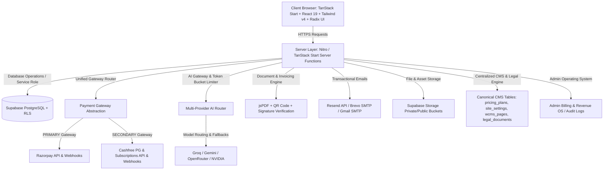

# Learnify AI — Master Production Audit & Discovery Report

## 1. Executive Summary & Product Identity Verification
- **Canonical Brand Name**: **Learnify AI** (Strictly preserve this identity; do NOT rename to "Learnify AI EdTech", "Learnify EdTech", "Learnify AI Pvt Ltd", "Learnify EdTech Pvt Ltd", or any invented company/LLP/Pvt Ltd entity).
- **Canonical Domain**: `https://www.learnifyai.in/` (Live site: `https://learnifyaitool.vercel.app/`).
- **Official Plan Matrix**:
  - **FREE**: ₹0/month. Free courses, community access, basic tools, **100 AI credits/month**.
  - **STUDENT**: CMS-controlled eligibility and discount configuration (verified via university/institution email).
  - **PRO**: **₹199/month**. CMS-controlled features and credits.
  - **CAREER PRO**: **₹499/month**. CMS-controlled features and credits.
  - **ENTERPRISE**: **Custom pricing / Contact Sales / Book a Demo** (Never displayed as "Free" or ₹0).
- **Payment Gateway Architecture**:
  - **PRIMARY**: Razorpay (`rzp_live_...` configured in `.env`).
  - **SECONDARY**: Cashfree (`cfsk_ma_prod_...` configured in `.env`).
- **Tax & Legal Policy Defaults**:
  - `tax_registered = false`, `tax_enabled = false`, `gstin = null`. Never invent fake GSTINs (e.g. `29XXXXX1234X1Z5`) or advertise "18% GST / GST Tax Invoice" unless actively configured by the owner.
  - Commercial policy: No routine 30-day money-back guarantee for normal change of mind. Structured exception-review workflow only.

---

## 2. Walkthrough Video Analysis (`Website Learnify AI.mp4`)
A forensic inspection of the 3-minute 20-second video walkthrough was performed by extracting and reviewing 20 keyframes (`frame_001.jpg` to `frame_020.jpg`):

1. **Pricing Page & Plan Toggle (`frame_001.jpg`)**:
   - Monthly/Yearly toggle shown with "Save 30%" badge.
   - Pro was displayed as `₹166.00/month` (`₹1,990/year billed yearly`).
   - Career Pro was displayed as `₹416.00/month` (`₹4,990/year billed yearly`).
   - Free plan was displayed with `500 AI credits / month` (Contradicts canonical 100 AI credits/month requirement).
   - **Severe UI Defect Observed**: Enterprise plan was formatted as **"Free"** because `price_inr: 0` in database caused the renderer to output "Free" instead of "Custom / Contact Sales".
2. **Student Discount Banner (`frame_018.jpg`)**:
   - "Verify your student email or upload your college ID and get an additional 20% off on all paid plans. Verify Now ->".
3. **Out-of-Sync Legal Copy (`frame_004.jpg`, `frame_006.jpg`)**:
   - Terms of Service in the video displayed contradictory legacy text: *"By subscribing to Pro (₹499/mo) or Team (₹4,999/mo)... Starter (Free) plan... 500 for Starter, 10,000 for Pro, and 50,000 for Team."*
   - Only mentioned Cashfree, completely omitting Razorpay.
4. **Checkout Interaction (`frame_018.jpg`, `frame_020.jpg`)**:
   - Clicking Pro opened a native **Razorpay Subscription Checkout modal** ("Your Subscription at Learnifyai", "Pro - Learnify AI", `₹199.00/month`).
5. **Admin Billing & Revenue OS (`frame_010.jpg`, `frame_014.jpg`)**:
   - 11 Tabs: Overview, Invoices, Payments, Subscriptions, Credits, Refunds, Taxes, Coupons, Cashfree, Subscription Analytics, Settings.
   - Real database-backed subscription rows displayed with statuses: `active`, `cancelled`, and action modals.

---

## 3. Architecture Map

---

## 4. Business Logic Map
| Subsystem | Current Controller / Location | Issues Identified | Target Canonical State |
| :--- | :--- | :--- | :--- |
| **Pricing & Plans** | Hardcoded `DEFAULT_TIERS` in `pricing.tsx`, `pricing_plans` in DB, `admin.content.view.tsx` | Multiple conflicting tiers; Free lists 500 credits; Enterprise displays "Free" when yearly toggled; Student plan missing from plan cards. | Centralized DB/CMS canonical truth via `pricing_plans`. Free=₹0 (100 credits), Student=CMS-discounted, Pro=₹199, Career Pro=₹499, Enterprise="Contact Sales / Book Demo". |
| **Payment Gateways** | `subscription.functions.ts`, `cart.tsx`, `wallet.tsx`, `cashfree-subscription.ts` | Razorpay webhook was deleted/missing; Cashfree had loose signature checks; client query `subscribe=ok` trusted for toast without server confirmation. | Unified `PaymentProvider` interface (`RazorpayProvider` [Primary] + `CashfreeProvider` [Secondary]). Server-verified activation, HMAC signature enforcement, idempotency table. |
| **Payment State Machine** | Ad-hoc strings in `user_subscriptions` and `payment_logs` | No normalized payment record table; pending/failed payments could lead to inconsistent states. | Normalized `payments` and `payment_events` schema with normalized states (`CREATED`, `PENDING`, `AUTHORIZED`, `CAPTURED`, `SUCCESS`, `FAILED`, `USER_DROPPED`, `RETRY_REQUIRED`, `REFUNDED`, `CANCELLED`). |
| **AI Credit Engine** | `src/routes/api/chat.ts`, `ai_credits` table | Hardcoded 500 credits for free tier (`chat.ts:148`); deductions flat 1 credit per request regardless of model/tokens. | Centralized Credit Engine with operation pricing rules (chat, tutor, ATS, resume, mock interview), 100 free credits/mo, configurable Pro/Career Pro caps. |
| **Course Entitlement** | `course.functions.ts`, `courses.$slug.tsx` | Client-side checks without strict backend `hasFeature` validation. | Strict server-side entitlement check: `hasFeature(userId, feature)` and `canAccessCourse(userId, courseId)`. |
| **Refund Workflow** | `billing.functions.ts`, `billing_refunds` | Promising automatic 30-day money back guarantee with <500 credits. | Exception-based refund request workflow (User request -> eligibility check -> admin review/decision -> provider refund API -> DB & email sync). No routine change-of-mind refunds. |
| **Invoice System** | `invoice-pdf.ts`, `invoices` table, `admin/billing.tsx` | Placeholder GSTIN `29XXXXX1234X1Z5`, invented legal name `Learnify EdTech Pvt. Ltd.`, "Email Invoice" only copied link to clipboard. | Real PDF receipt/invoice generator adhering to `tax_enabled` setting; real transactional invoice delivery via email. |
| **Legal Architecture** | `CustomPageContent.tsx`, `site_settings` keys (`page_terms`, etc.) | Full policies shown indiscriminately; legacy text mentioning ₹4999 Team plan and Cashfree only; missing `/legal` Legal Center; no contextual legal notice component. | Dedicated `/legal` Central Legal Center + `ContextualLegalNotice` component; policy versioning and `legal_acknowledgements` table. |

---

## 5. Conflict Map (Audit Search Results)

| Search Pattern | Occurrences in Codebase | Classification | Required Remediation |
| :--- | :--- | :--- | :--- |
| **₹139** | RGBA color strings and SVG path definitions | False match (Graphics) | No change required. |
| **₹349** | `SavingsCalculator.tsx:81` (`cost: 349`) | Legacy hardcoded comparison value | Update to reflect canonical comparison figures. |
| **₹199** | Pro plan monthly price in `pricing.tsx`, `admin.content.view.tsx`, `pricing_plans` DB, `welcome-email.functions.ts` | **Current Canonical** | Retain as official Pro monthly price. Remove conflicts in legal texts where it was misquoted. |
| **₹499** | Career Pro monthly price in `pricing.tsx`, `admin.content.view.tsx`, `pricing_plans` DB, `SavingsCalculator.tsx` | **Current Canonical** | Retain as official Career Pro monthly price. Remove legacy text in `page_terms` claiming Pro is ₹499. |
| **500 (AI Credits)** | `pricing.tsx:116`, `admin.content.view.tsx:1535`, `refund-policy.tsx:29`, `chat.ts:148`, `docs.tsx:470` | **Legacy Conflict** | Replace all free tier credits with canonical **100 AI credits/month** driven by database configuration. |
| **100 AI credits** | Intended Free Plan monthly quota | **Current Canonical** | Standardize in DB and UI as the single source of truth for Free users. |
| **10,000 / 25,000** | `pricing.tsx`, `admin.content.view.tsx`, `ai.tsx`, `pricing_plans` DB | Current Tier Quotas / Stale references | Ensure these quotas are driven by database configurations, not hardcoded frontend strings. |
| **30-day / money-back** | `pricing.tsx:330,735,792,1389`, `refund-policy.tsx:28`, `admin.content.view.tsx:3639` | **Prohibited Claim** | Remove all false "30-day money-back guarantee" claims. Align with standard exception-review refund policy. |
| **GST / GSTIN** | `invoice-pdf.ts:50`, `InvoiceDesigner.tsx:40`, `terms.tsx:31`, `privacy.tsx:19`, `billing_settings` DB | **Invented / Placeholder Data** | Set `tax_enabled = false`, `tax_registered = false`, `gstin = null` by default. Only display tax details if explicitly enabled in admin settings. |
| **Learnify EdTech / Pvt Ltd** | `invoice-pdf.ts:49`, `InvoiceDesigner.tsx:39`, `admin.content.view.tsx:2101`, `billing_settings` DB | **Invented Entity Name** | Replace with canonical brand **Learnify AI**. Remove all unverified corporate structure claims. |
| **Starter / Team** | `cashfree-subscription.ts:379`, `site_settings` (`page_terms`), `pricing.tsx:204` | **Deprecated Legacy Plans** | Eliminate references. Consumer plans are FREE, STUDENT, PRO, CAREER PRO; ENTERPRISE is Custom/Contact Sales. |
| **Enterprise** | `pricing.tsx`, `pricing_plans` table | Misconfigured Tier | Invert `price_inr: 0` logic so Enterprise renders as "Contact Sales / Book Demo", never "Free". |
| **Razorpay** | `.env` credentials exist, installed in `package.json`, demonstrated in video | **Primary Gateway (Incomplete in Code)** | Implement primary `RazorpayProvider`, Razorpay order/subscription creation, client checkout modal, server verification, and `/api/webhooks/razorpay`. |
| **Cashfree** | Fully integrated in `subscription.functions.ts`, `cart.tsx`, `wallet.tsx`, webhook | **Secondary Gateway** | Retain as secondary gateway; harden webhook signature validation and idempotency handling. |

---

## 6. Gap Analysis & Proposed Architectural Upgrades

### A. Database Enhancements (Safe & Additive Migrations)
1. **`payments` Table**: Normalized table tracking all transactions across Razorpay and Cashfree (`internal_payment_id`, `user_id`, `provider`, `provider_order_id`, `provider_payment_id`, `subscription_id`, `plan_id`, `amount_inr`, `status`, `currency`, `metadata`, `failure_reason`).
2. **`legal_documents` & `legal_acknowledgements` Tables**: Store versioned legal policies and user acceptance timestamps with IP/user-agent auditing.
3. **`student_verifications` Table**: Track student eligibility, institution, verification status, document/email proof, expiration, and admin audit log.
4. **`ai_operation_pricing` Table / Configuration**: Centralized operation costs for credit deductions (chat, tutor, ATS, resume, mock interview).

### B. Payment Architecture
1. **`PaymentProvider` Abstraction**:
   - `createSubscriptionOrder(planId, userId, coupon)`
   - `verifyPayment(payload)`
   - `cancelSubscription(subscriptionId)`
   - `processRefund(paymentId, amount, reason)`
2. **Strict Webhook Engine**:
   - Razorpay Webhook endpoint (`/api/webhooks/razorpay`) with secret validation (`RAZORPAY_WEBHOOK_SECRET`).
   - Cashfree Webhook endpoint (`/api/webhooks/cashfree-subscription`) enforcing mandatory HMAC verification and duplicate rejection.
   - Atomic entitlement updates upon server verification (never trust frontend queries like `subscribe=ok`).

### C. Contextual Legal Architecture
1. **Central Legal Center (`/legal`)**: Hub listing all published legal documents with version, effective date, and description.
2. **`ContextualLegalNotice` Component**:
   - Checkout: Compact modal / checkbox links to Terms, Privacy, Refund, and Digital Delivery.
   - Community: Guidelines acknowledgement banner shown once per policy version.
   - AI Tools: Brief AI Disclaimer banner on first meaningful use.
   - Content Upload: IP and Acceptable Use policy reminder.
   - Clean public footer referencing Legal Center.

### D. Billing & Admin OS
1. User **Account Settings -> Billing & Payments**:
   - Current plan display, billing interval, renewal date, access-until date.
   - Safe masked payment method.
   - Complete real payment history table with true status (Paid, Pending, Failed, Refunded).
   - Real invoice download and functional email invoice delivery.
2. Admin **Billing & Revenue Dashboard**:
   - Real database-driven payment search, filtering (by provider, status, date), and export.
   - Manual reconciliation tool comparing provider records against database state.
